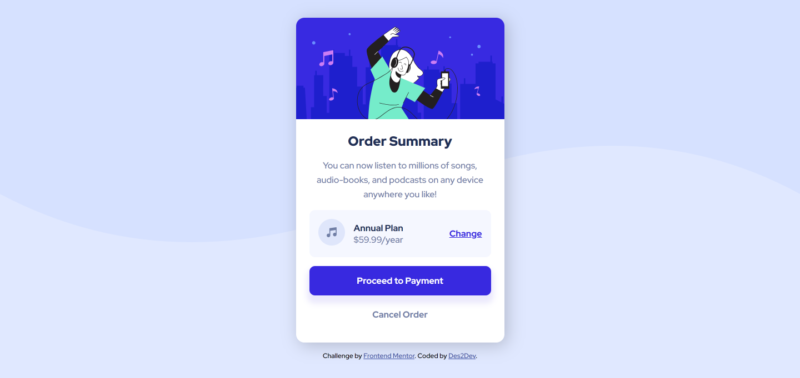

# Frontend Mentor - Order summary card solution

This is a solution to the [Order summary card challenge on Frontend Mentor](https://www.frontendmentor.io/challenges/order-summary-component-QlPmajDUj). Frontend Mentor challenges help you improve your coding skills by building realistic projects.

## Table of contents

1. [Frontend Mentor - Order summary card solution](#frontend-mentor---order-summary-card-solution)
   1. [Table of contents](#table-of-contents)
   2. [Overview](#overview)
      1. [The challenge](#the-challenge)
      2. [Screenshot](#screenshot)
      3. [Links](#links)
   3. [My process](#my-process)
      1. [Built with](#built-with)
      2. [Useful resources](#useful-resources)
   4. [Author](#author)

## Overview

### The challenge

Users should be able to:

- See hover states for interactive elements

### Screenshot

### Links

- [Solution URL here](https://your-solution-url.com)
- [Live site URL here](https://des2dev.github.io/order-summary-card-component/)

## My process

### Built with

- Semantic HTML5 markup
- CSS custom properties
- Flexbox
- Mobile-first workflow
- BEM methodology

### Useful resources

- [Flexbox](https://developer.mozilla.org/en-US/docs/Web/CSS/CSS_Flexible_Box_Layout/Basic_Concepts_of_Flexbox)
- [CSS custom properties](https://developer.mozilla.org/en-US/docs/Web/CSS/Using_CSS_custom_properties)
- [BEM methodology](https://en.bem.info/methodology/)

## Author

- Frontend Mentor - [@Des2Dev](https://www.frontendmentor.io/profile/Des2Dev)
